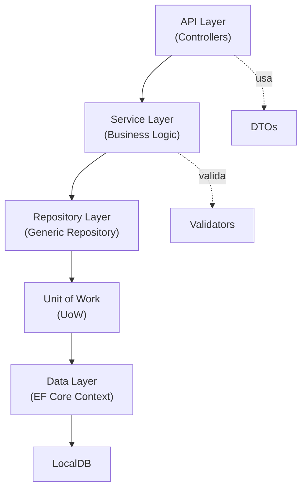

# PRD: API de Gestión de Tareas

## 1. Visión General del Producto

API RESTful para gestión de tareas que implementa patrones de arquitectura empresarial con .NET 8 con CONTROLADORES IMPORTANTE, Entity Framework Core, y LocalDB.

## 2. Objetivos del Proyecto

- Crear una API simple y escalable para gestión de tareas (CRUD completo)
- Implementar patrones Repository y Unit of Work
- Utilizar DTOs para separación de concerns
- Implementar validación robusta de datos
- Persistencia con Entity Framework Core y LocalDB

## 3. Arquitectura Técnica

### 3.1 Stack Tecnológico

- **.NET 8** (Web API)
- **Entity Framework Core 8** (ORM)
- **SQL Server LocalDB** (Base de datos)
- **FluentValidation** (Validación de DTOs)
- **AutoMapper** (Mapeo DTO ↔ Entidad)

### 3.2 Capas de la Aplicación



## 4. Especificaciones Funcionales

### 4.1 Entidades del Dominio

### **Task** (Tarea)

| Campo | Tipo | Requerido | Descripción |
| --- | --- | --- | --- |
| Id | Guid | Sí | Identificador único |
| Title | string | Sí | Título de la tarea (max 200 chars) |
| Description | string | No | Descripción detallada |
| Status | enum | Sí | Pending, InProgress, Completed |
| Priority | enum | Sí | Low, Medium, High |
| DueDate | DateTime? | No | Fecha de vencimiento |
| CreatedAt | DateTime | Sí | Fecha de creación |
| UpdatedAt | DateTime | Sí | Última actualización |

### 4.2 Endpoints de la API

| Método | Endpoint | Descripción | Request | Response |
| --- | --- | --- | --- | --- |
| GET | `/api/tasks` | Listar todas las tareas | - | `IEnumerable<TaskDto>` |
| GET | `/api/tasks/{id}` | Obtener tarea por ID | Guid | `TaskDto` |
| POST | `/api/tasks` | Crear nueva tarea | `CreateTaskDto` | `TaskDto` (201) |
| PUT | `/api/tasks/{id}` | Actualizar tarea | `UpdateTaskDto` | `TaskDto` (200) |
| DELETE | `/api/tasks/{id}` | Eliminar tarea | Guid | 204 No Content |
| GET | `/api/tasks/status/{status}` | Filtrar por estado | TaskStatus | `IEnumerable<TaskDto>` |

## 5. Modelos de Datos (DTOs)

### 5.1 TaskDto (Lectura)

```csharp
public class TaskDto
{
    public Guid Id { get; set; }
    public string Title { get; set; }
    public string? Description { get; set; }
    public string Status { get; set; }
    public string Priority { get; set; }
    public DateTime? DueDate { get; set; }
    public DateTime CreatedAt { get; set; }
    public DateTime UpdatedAt { get; set; }
}

```

### 5.2 CreateTaskDto (Escritura)

```csharp
public class CreateTaskDto
{
    public string Title { get; set; }
    public string? Description { get; set; }
    public string Status { get; set; }
    public string Priority { get; set; }
    public DateTime? DueDate { get; set; }
}

```

### 5.3 UpdateTaskDto (Actualización)

```csharp
public class UpdateTaskDto
{
    public string Title { get; set; }
    public string? Description { get; set; }
    public string Status { get; set; }
    public string Priority { get; set; }
    public DateTime? DueDate { get; set; }
}

```

## 6. Reglas de Validación

### CreateTaskDto / UpdateTaskDto

- **Title**: Requerido, longitud entre 3-200 caracteres
- **Description**: Opcional, máximo 1000 caracteres
- **Status**: Requerido, debe ser valor válido del enum (Pending, InProgress, Completed)
- **Priority**: Requerido, debe ser valor válido del enum (Low, Medium, High)
- **DueDate**: Opcional, debe ser fecha futura

## 7. Patrones de Diseño

### 7.1 Generic Repository Pattern

```csharp
public interface IRepository<T> where T : class
{
    Task<T?> GetByIdAsync(Guid id);
    Task<IEnumerable<T>> GetAllAsync();
    Task<IEnumerable<T>> FindAsync(Expression<Func<T, bool>> predicate);
    Task AddAsync(T entity);
    void Update(T entity);
    void Delete(T entity);
}

```

### 7.2 Unit of Work Pattern

```csharp
public interface IUnitOfWork : IDisposable
{
    IRepository<TaskEntity> Tasks { get; }
    Task<int> SaveChangesAsync();
}

```

## 8. Estructura del Proyecto

```
TaskManagementApi/
├── TaskManagementApi.Api/          # Capa de presentación
│   ├── Controllers/
│   ├── Middlewares/
│   └── Program.cs
├── TaskManagementApi.Core/         # Capa de dominio
│   ├── Entities/
│   ├── Enums/
│   └── Interfaces/
├── TaskManagementApi.Application/  # Capa de aplicación
│   ├── DTOs/
│   ├── Validators/
│   ├── Mappings/
│   └── Services/
├── TaskManagementApi.Infrastructure/ # Capa de infraestructura
│   ├── Data/
│   ├── Repositories/
│   └── UnitOfWork/

```

## 9. Configuración de Base de Datos

### Connection String (LocalDB)

```json
{
  "ConnectionStrings": {
    "DefaultConnection": "Server=(localdb)\\\\mssqllocaldb;Database=TaskManagementDb;Trusted_Connection=true;TrustServerCertificate=true"
  }
}

```

## 10. Respuestas de Error

### Estructura de Error Estándar

```json
{
  "statusCode": 400,
  "message": "Validation failed",
  "errors": [
    "Title is required",
    "DueDate must be in the future"
  ]
}

```

### Códigos de Estado HTTP

- **200 OK**: Operación exitosa
- **201 Created**: Recurso creado
- **204 No Content**: Eliminación exitosa
- **400 Bad Request**: Validación fallida
- **404 Not Found**: Recurso no encontrado
- **500 Internal Server Error**: Error del servidor

## 11. Dependencias NuGet

```xml
<PackageReference Include="Microsoft.EntityFrameworkCore" Version="8.0.*" />
<PackageReference Include="Microsoft.EntityFrameworkCore.SqlServer" Version="8.0.*" />
<PackageReference Include="Microsoft.EntityFrameworkCore.Tools" Version="8.0.*" />
<PackageReference Include="AutoMapper.Extensions.Microsoft.DependencyInjection" Version="12.0.*" />
<PackageReference Include="FluentValidation.AspNetCore" Version="11.3.*" />

```

## 12. Criterios de Aceptación

✅ CRUD completo de tareas funcional

✅ Validación de DTOs implementada

✅ Repository genérico y UoW operativos

✅ Migraciones de EF Core aplicadas

✅ LocalDB configurado correctamente

✅ Manejo de errores centralizado

✅ Documentación Swagger disponible

## 13. Fases de Implementación

**Fase 1**: Estructura del proyecto y entidades core

**Fase 2**: Implementación de Repository y UoW

**Fase 3**: DbContext y configuración de EF Core

**Fase 4**: DTOs, validadores y AutoMapper

**Fase 5**: Controllers y endpoints

**Fase 6**: Middleware de manejo de errores

**Fase 7**: Testing y documentación